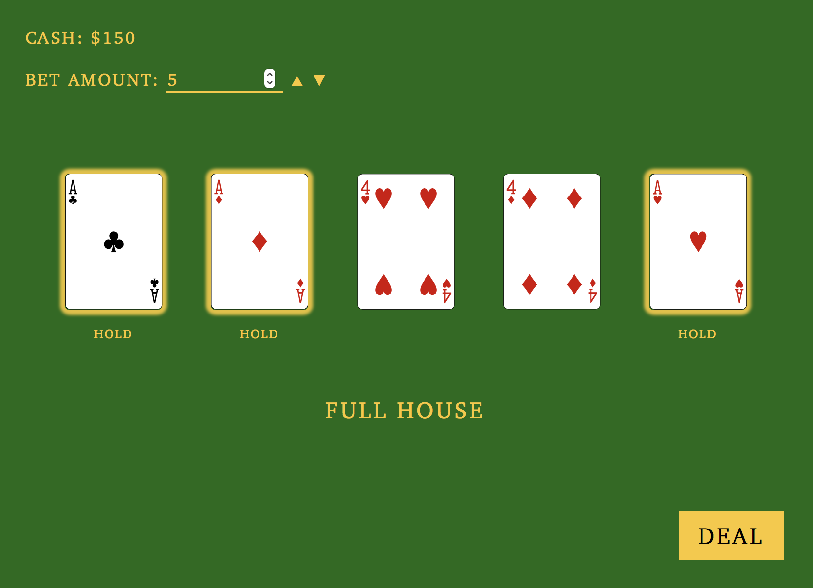

# 5card

5card is a solitaire version of the Five Card Draw poker variant. It's played in the browser and is powered by [Vue.js](http://vuejs.org/).

## How to play

1. Adjust your bet. Minimum bet is $5.
2. Press Deal to start.
3. Choose the cards you want to **hold**.
4. Click draw and hope for the best.
5. Repeat.

You start with $100. If you go broke, your cash balance will reset to $100. You balance is stored in your browser’s localStorage between sessions.

## Scoring

| Hand                       | Multiply bet by |
| :------------------------- | --------------: |
| Royal Straight Flush       |            x 60 |
| Straight Flush             |            x 30 |
| Four of a Kind             |            x 20 |
| Full House                 |            x 15 |
| Flush                      |            x 10 |
| Straight                   |            x  7 |
| Three of a Kind            |            x  3 |
| Two Pair                   |            x  2 |
| One Pair (Jacks or better) |            x  1 |